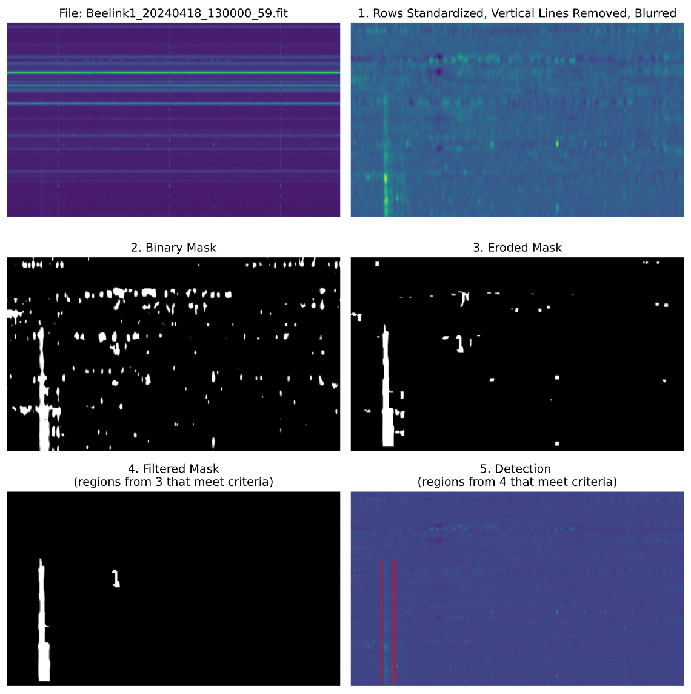

# Morphological Operations Detection

### Objective:
Find burst candidate regions which can later be analyzed and filtered to detect solar radio bursts.

### Overview
One of the main challenges with detecting bursts with in our LWA data is the low signal to noise ratio. To address this challenge, morphological operations are used to reduce noise: 
1. Apply an intensity threshold to create a binary image representation of a spectrogram. 
2. Use morphological erosion to remove noise regions and generate bounding boxes around potential bursts.
3. Filter the remaining boxes to identify the most likely burst candidates
4. Apply these steps to all spectrogram samples, saving characterisitics of each predicted bounding box. 
The characteristics for each sample form a new dataset that can be used to train a binary classification model. This model will classify each bounding box as either burst (positive) or non-burst (false positive)

### Steps
1. **Preprocess Raw Input:** 
    - Standardize rows to remove horizontal lines.
    - Remove consistent vertical lines that appear in collected data.
    - Apply blurring (Gaussian kernel) to enhance burst.
2. **Binary Mask:** 
    - Use a percentile threshold of intensity value to create a binary mask.
    - The current threshold is set at 95%, determined by empirically testing various values.
3. **Apply Morphological Operations:** 
    - Remove small components and enhance larger structures (potential bursts).
    - There are three arguments to the morphological function which are the size of the structure element.
4. **Filter Connected Components (white regions):** 
    - Filter the remaining connected components after the morphological operations. The main criteria for filtering is based on size and shape. Additinal criteria were added to include type 2 bursts and to redcue false positives. For more information on this step, refer to `filtered_components()` in the ([preprocessing reference](../utils/preprocessing.md)).
5. **Detection Candidates:**
    - Plotting bounding boxes around the regions that passed all filter criteria.

### Dataset

### Box classification model

### Code
The code for all processing steps is in `radburst/utils/preprocessing.py` ([reference](../utils/preprocessing.md)). The code used to create the plots below is found in `notebooks/exploration/preprocessing.ipynb`.

### Results and Analysis
- **Burst Detections:** This method has been used to detect possible burst regions in all samples that were [classified over the summer](https://docs.google.com/document/d/1YfonaM4mR5wb6eVOeXuNQUpLTaiJpuKH_D6yrXy9aA4/edit?tab=t.0). A PDF of these results showing all steps described above for each burst can be found [here](https://github.com/Kasper-Heliophysics-MDP/radburst/blob/ml-detection/notebooks/exploration/preprocessing_detection_plots_bursts.pdf). 
- **Current Limitations:** The current processing and filtering criteria leads to some false positives in samples with no bursts. These false positives are usually noisy regions with a burst-like appearance. To see examples of this, [here](https://github.com/Kasper-Heliophysics-MDP/radburst/blob/ml-detection/notebooks/exploration/preprocessing_detection_plots_nonbursts.pdf) is a PDF containing detections for non-burst samples. 

### Next Steps:
- Future work can be done to statistically analyze candidate burst regions and determine whether or not a burst is present. This would invovle comparisons between bursts found detected in burst samples and bursts detected in non-burst samples.
- One possible implementation would be comparing the mean intensity inside the detection bounding box(s) with the mean instensity outside the box. For true positives, the value inside the box should be noticably greater than outside. However, for false positives, we would expect the value inside to be relatively similar in instensity to the noise in the rest of the array. While this may help with some false positives, it may remove detections of very faint true burst predictions that aren't intense.

### Examples

